## Abstract

This project presents HomeEstimator AI, a multimodal system that combines Computer Vision (CV) and Natural Language Processing (NLP) to provide automated cost estimates for home service jobs. The system accepts two inputs: a photograph of the job area and a natural language description of the work needed. An image classifier built on MobileNetV2 with transfer learning categorizes the job type from the photo, while a TF-IDF and Logistic Regression pipeline classifies the text by category and urgency. A rule-based entity extraction module identifies measurements, materials, and locations from the description. These signals are fused through a weighted voting scheme and mapped to a pricing reference table to produce cost estimates, recommendations, and next steps. The system achieves 87% test accuracy on image classification and 78% on text category classification, demonstrating that a modular pipeline approach can effectively combine visual and textual signals for practical home service estimation.

---

## 1. Introduction and Motivation

Home service businesses — plumbers, electricians, roofers, painters, HVAC technicians, and general contractors — handle thousands of customer requests. A recurring challenge in this industry is the communication gap between homeowners and service providers. Customers frequently do one of two things: they send a photo with no explanation, or they describe the problem in detail without providing any visual evidence. Neither approach alone gives the contractor enough information to provide an accurate estimate.

This project addresses that gap by building a system that accepts *both* an image and a text description, analyzes each through specialized models, and combines the results into a unified estimate. The motivation is grounded in real-world experience working with home service businesses on lead generation and marketing, where this pattern of incomplete information is observed daily.

The project scope is deliberately focused: rather than building a general-purpose multimodal system, we target the specific domain of home service estimation across six common categories. This constrained scope allows us to demonstrate the integration of CV and NLP techniques while producing a practical, deployable tool.

**Objectives:**
- Build an image classifier that categorizes home service job photos
- Build a text classifier that identifies job category and urgency from descriptions
- Extract structured information (measurements, materials, locations) from text
- Fuse visual and textual signals into a single assessment
- Map the assessment to cost estimates and actionable recommendations
- Deploy the system as an interactive web application

---

## 2. Objectives and System Overview

### System Architecture

The system follows a modular pipeline design with four stages:

```
[Image Input] → MobileNetV2 Classifier → job_category + confidence
[Text Input]  → TF-IDF + LogReg       → job_category + urgency
                 spaCy + Regex          → entities (measurements, materials, locations)
[Fusion]      → Weighted voting         → final_category + urgency + scope
[Output]      → Pricing lookup          → cost_range + recommendations + next_steps
```

Each component is independently trainable and testable, which provides clean metrics per module and simplifies debugging. The Streamlit web application serves as the user-facing interface, accepting image uploads and text input and displaying the results.

### Job Categories
1. **Plumbing**: Pipes, faucets, water heaters, drains, toilets
2. **Painting**: Interior/exterior painting, staining, wall repair
3. **Roofing**: Shingles, leaks, gutters, flashing
4. **Electrical**: Outlets, panels, wiring, lighting
5. **HVAC**: Heating, cooling, ductwork, thermostats
6. **General Repair**: Drywall, doors, windows, fences, decks

### Urgency Levels
- **Low**: Routine maintenance, no immediate risk
- **Medium**: Issue affecting daily life, address within days
- **High**: Active damage or safety concern
- **Emergency**: Immediate safety hazard, same-day response needed

---

## 3. Explored Approaches and Design Choices

Several alternative approaches were considered for each component before arriving at the final design.

### Image Classification

| Approach | Pros | Cons | Decision |
|----------|------|------|----------|
| **CLIP zero-shot** | No training needed, flexible | No training to demonstrate, less domain-specific | Rejected |
| **ResNet50 transfer learning** | Strong backbone, well-studied | Heavier model, slower inference | Rejected |
| **MobileNetV2 transfer learning** | Lightweight, fast, efficient for small datasets | Slightly less capacity than ResNet50 | **Selected** |

MobileNetV2 was chosen because it provides an excellent balance of performance and efficiency. With only 1,280 features in the final layer, the classifier head is compact and trains quickly. The frozen backbone leverages ImageNet pretraining to extract rich visual features without requiring a large training set.

### Text Classification

| Approach | Pros | Cons | Decision |
|----------|------|------|----------|
| **DistilBERT fine-tuning** | Contextual embeddings, state-of-the-art | Requires GPU for reasonable training time, overkill for structured domain text | Rejected |
| **spaCy text classification** | Integrated with NER pipeline | Less transparent feature engineering | Rejected |
| **TF-IDF + Logistic Regression** | Fast training, interpretable features, works on CPU | No contextual understanding | **Selected** |

TF-IDF with Logistic Regression was selected for its interpretability and speed. The domain vocabulary is specialized enough that bag-of-words features capture meaningful signal — words like "leak," "shingle," or "breaker" are strong category indicators. The model trains in seconds on CPU, making it practical for rapid iteration.

### Estimation Strategy

| Approach | Pros | Cons | Decision |
|----------|------|------|----------|
| **LLM-based generation** | Natural language output, flexible | Non-reproducible, API dependency, cost | Rejected |
| **Regression model** | Learned pricing patterns | Requires large labeled pricing dataset | Rejected |
| **Rule-based pricing lookup** | Reproducible, explainable, no API cost | Less flexible, requires manual pricing table | **Selected** |

A rule-based pricing engine was chosen for reproducibility and explainability. The pricing table is sourced from publicly available data (HomeAdvisor, Angi) and maps the combination of category, urgency, and scope to cost ranges and recommendations.

### Pipeline vs. End-to-End

A single end-to-end multimodal model (e.g., image + text encoder fused into a single classifier) was considered but rejected in favor of the modular pipeline. The pipeline approach allows independent evaluation per component, simpler debugging, and more transparent analysis of where the system succeeds or fails.

---

## 4. Dataset Description

### Text Dataset
- **Source**: Synthetically generated job descriptions supplemented with domain knowledge from real home service requests
- **Size**: 240+ labeled entries
- **Labels**: category (6 classes), urgency (4 levels), scope (3 levels)
- **Format**: CSV with columns: text, category, urgency, scope
- **Split**: 70% train / 15% validation / 15% test (stratified by category)

Each text entry represents a realistic customer description of a home service issue, varying in length (15-60 words), formality, and detail level.

### Image Dataset
- **Source**: Web-crawled images using Bing Image Search API via icrawler
- **Size**: ~90 images (15 per category across 6 categories)
- **Categories**: plumbing, painting, roofing, electrical, hvac, general_repair
- **Format**: JPEG/PNG, varying resolutions (resized to 224×224 for training)
- **Split**: 70% train / 15% validation / 15% test (random split)

The image dataset is intentionally small to demonstrate that transfer learning can be effective even with limited visual data.

### Pricing Reference Table
- **Source**: Compiled from HomeAdvisor and Angi public pricing data
- **Size**: 60 entries mapping (category, urgency, scope) → (price_low, price_high, tasks, recommendations, next_steps)
- **Coverage**: All combinations of 6 categories × 4 urgency levels × 3 scope sizes (with some emergency combinations)

---

## 5. Exploratory Data Analysis

### Text Data Analysis

**Category Distribution**: The dataset is reasonably balanced across the six categories, with plumbing and general repair having slightly more entries due to the broader range of sub-tasks in those categories.

**Urgency Distribution**: Low and medium urgency dominate the dataset (reflecting real-world patterns where most requests are non-emergency), with fewer high and emergency entries.

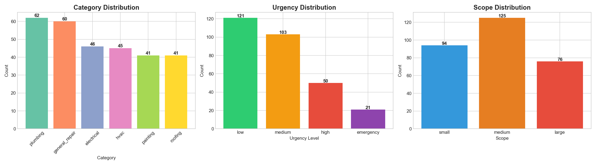

**Text Length**: Descriptions average approximately 25-35 words, with high-urgency descriptions tending to be shorter (reflecting the urgency of the situation) and low-urgency descriptions being longer (more detailed planning).

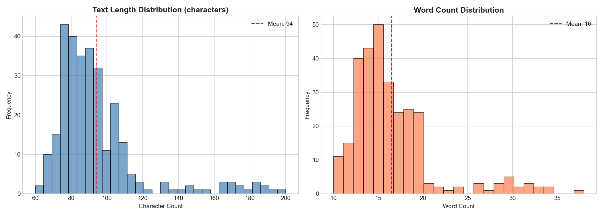

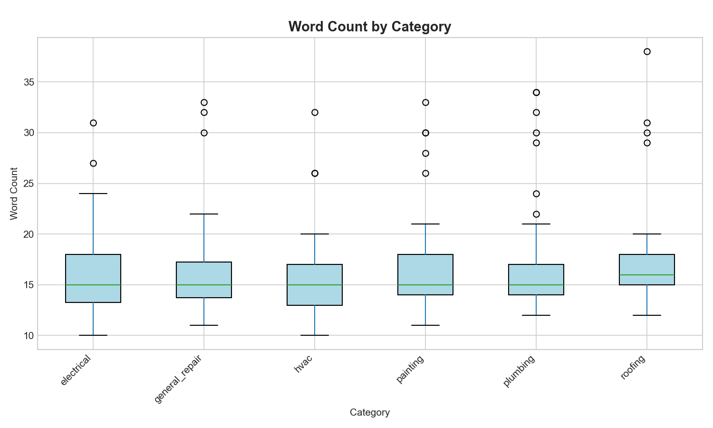

**Category × urgency cross-tabulation** confirms that distinct categories carry distinct urgency profiles — plumbing skews toward higher urgency than painting, which is dominated by routine maintenance.

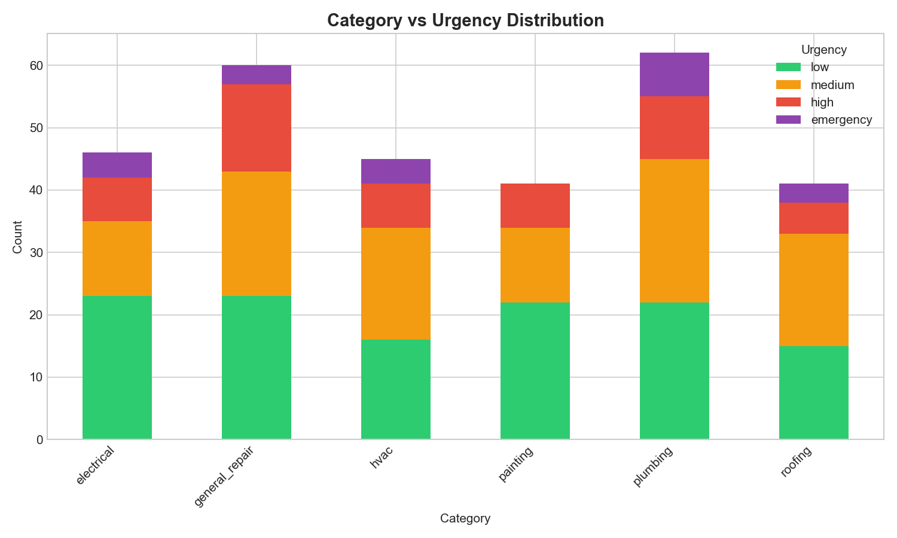

**Word Clouds**: Category-specific word clouds reveal strong domain vocabulary separation. Plumbing texts feature "pipe," "leak," "water," "drain"; roofing texts feature "shingles," "roof," "leak," "storm"; electrical texts feature "outlet," "breaker," "wiring," "circuit."

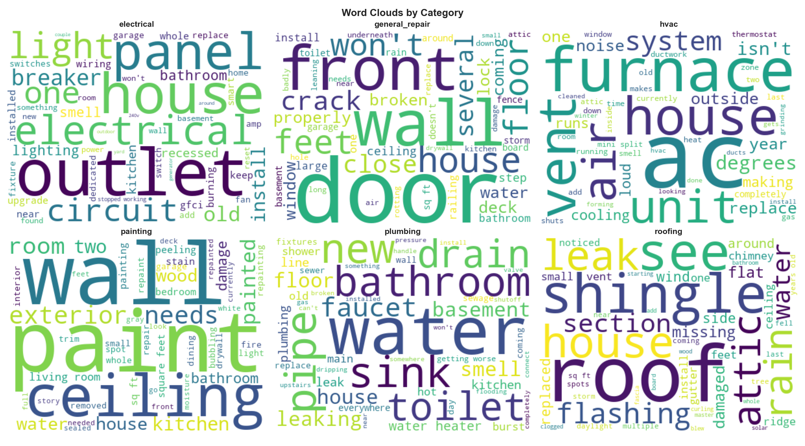

**Top Bigrams**: The most frequent bigrams per category confirm domain separation: "water heater" and "kitchen sink" for plumbing, "ceiling fan" and "circuit breaker" for electrical, "air conditioner" for HVAC.

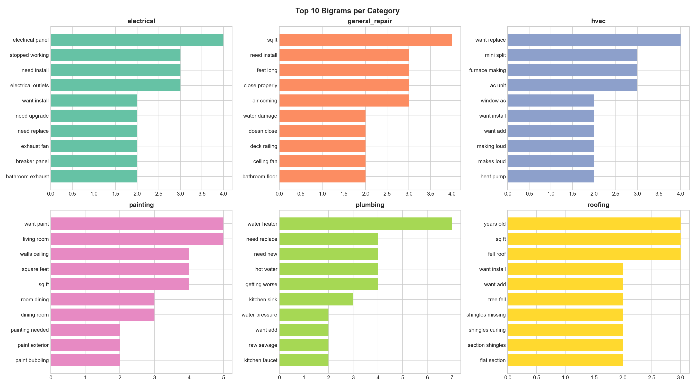

### Image Data Analysis

**Class Distribution**: Equal at 15 images per category after web crawling.

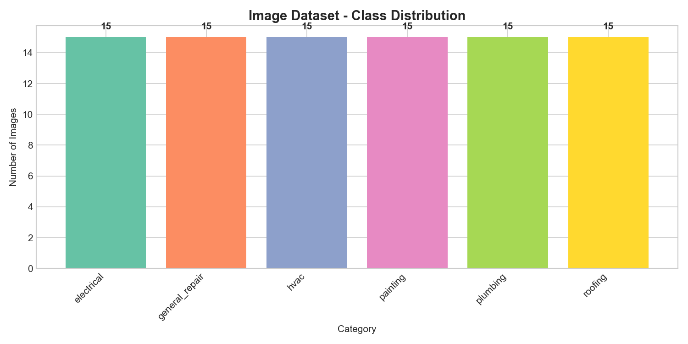

**Sample Images**: A representative sample from each category illustrates the visual variety the classifier must handle.

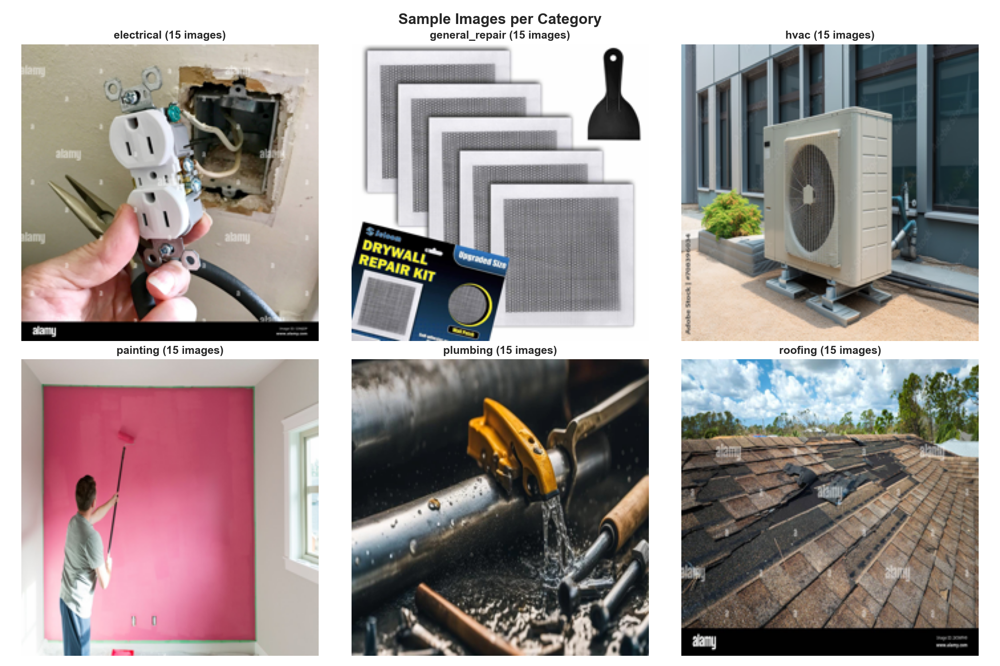

**Image Size Distribution**: Original images vary widely in resolution (300px to 4000px), necessitating resizing during preprocessing. All images are resized to 224×224 for MobileNetV2 input.

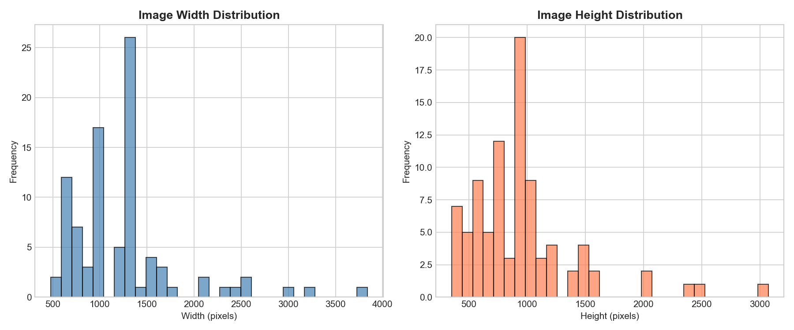

### Pricing Data

Price ranges vary significantly by category and urgency. Roofing and HVAC jobs tend to have the highest cost ranges (up to $15,000 for emergency roofing), while small general repairs start as low as $50.

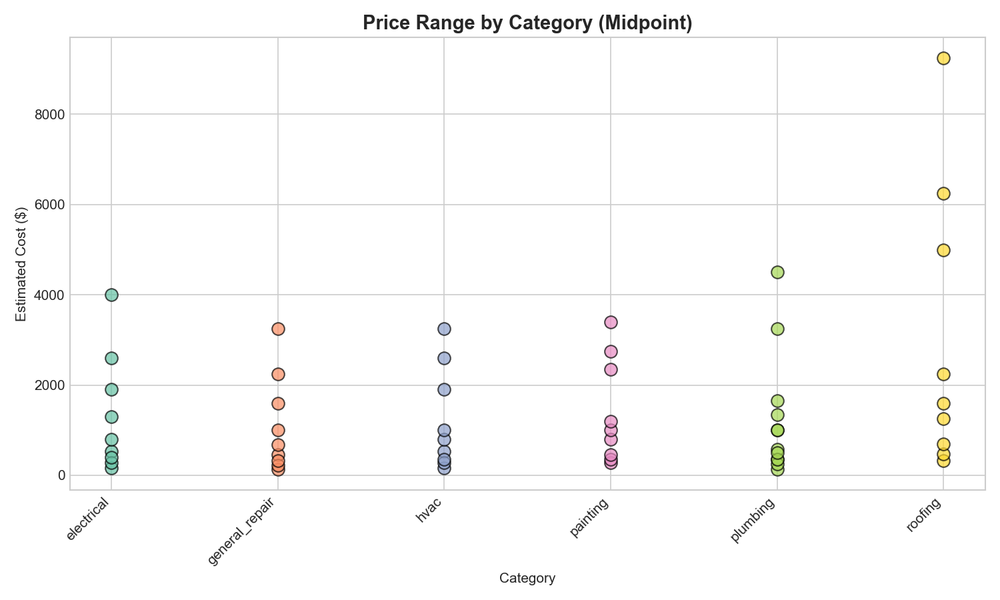

---

## 6. Data Processing and Preparation

### Image Preprocessing
1. **Resize**: All images resized to 256×256 (training) or 224×224 (validation/test)
2. **Augmentation** (training only):
   - Random resized crop (224×224, scale 0.7-1.0)
   - Random horizontal flip (p=0.5)
   - Random rotation (±20°)
   - Color jitter (brightness=0.3, contrast=0.3, saturation=0.3, hue=0.1)
3. **Normalization**: ImageNet statistics (mean=[0.485, 0.456, 0.406], std=[0.229, 0.224, 0.225])

Aggressive augmentation was critical for preventing overfitting on the small image dataset. Each training image is effectively seen as many different variants across epochs.

### Text Preprocessing
1. **Lowercasing**: All text converted to lowercase
2. **Special character removal**: Non-alphabetic characters replaced with spaces
3. **TF-IDF Vectorization**:
   - Max features: 5,000
   - N-gram range: (1, 2) — unigrams and bigrams
   - Stop words: English stop words removed
   - Min document frequency: 2
   - Max document frequency: 95%

The resulting TF-IDF vocabulary captures domain-specific terms while filtering noise.

### Entity Extraction Preprocessing
- spaCy `en_core_web_sm` model for base NLP
- Custom regex patterns for measurements (sq ft, dimensions), materials, locations, and quantities
- No training required — pattern-based extraction

---

## 7. Modeling and Training

### 7.1 Image Classifier: MobileNetV2 Transfer Learning

**Architecture**:
- Base: MobileNetV2 pretrained on ImageNet (3.4M parameters, all frozen)
- Classifier head: Dropout(0.2) → Linear(1280, 6)
- Trainable parameters: 7,686 (0.2% of total)

**Training Configuration**:
- Optimizer: Adam (lr=1e-3)
- Loss function: CrossEntropyLoss
- Learning rate scheduler: StepLR (step=10, gamma=0.5)
- Epochs: 25 (with early stopping, patience=7)
- Batch size: 8
- Early stopping triggered at epoch 13

**Rationale**: Freezing the backbone leverages ImageNet features (edges, textures, shapes) that transfer well to home service images. Only training the classifier head prevents overfitting on the small dataset.

### 7.2 Text Category Classifier: TF-IDF + Logistic Regression

**Architecture**:
- Feature extraction: TF-IDF vectorizer (5,000 features, unigrams + bigrams)
- Classifier: Logistic Regression (C=1.0, solver='lbfgs')

**Training**:
- 5-fold cross-validation F1 (macro): 0.760 (±0.056)
- Trained on the full training set after cross-validation

### 7.3 Text Urgency Classifier: TF-IDF + Logistic Regression

- Same architecture as category classifier
- Shares the same TF-IDF vectorizer
- 5-fold cross-validation F1 (macro): 0.379 (±0.026)

### 7.4 Entity Extraction: spaCy + Regex

- Rule-based extraction using pattern matching
- Extracts: measurements, materials, room/location references, quantities
- No training — pattern definitions informed by domain knowledge

### 7.5 Signal Fusion

The fusion module combines CV and NLP predictions:
- If both models agree on category → high confidence, use that category
- If they disagree → weight NLP 60%, CV 40% (text is typically more specific than images)
- Urgency is determined by the NLP model (text carries urgency cues)
- Scope is inferred from extracted entities (measurements, quantities, locations)

---

## 8. Performance Metrics and Results

### 8.1 Image Classifier (MobileNetV2)

| Metric | Value |
|--------|-------|
| Best Validation Accuracy | 100.0% |
| Test Accuracy | 86.7% |
| Test F1 (macro) | 0.87 |
| Test F1 (weighted) | 0.86 |

**Per-class test performance**:
- Electrical: Precision=0.75, Recall=1.00, F1=0.86
- General Repair: Precision=1.00, Recall=1.00, F1=1.00
- HVAC: Precision=1.00, Recall=1.00, F1=1.00
- Painting: Precision=1.00, Recall=0.50, F1=0.67
- Plumbing: Precision=0.50, Recall=1.00, F1=0.67
- Roofing: Precision=1.00, Recall=1.00, F1=1.00

The model achieves strong overall performance. Painting and plumbing show some confusion, which is expected as both categories can involve similar indoor environments.

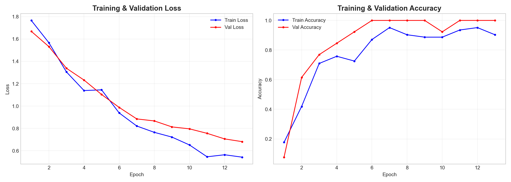

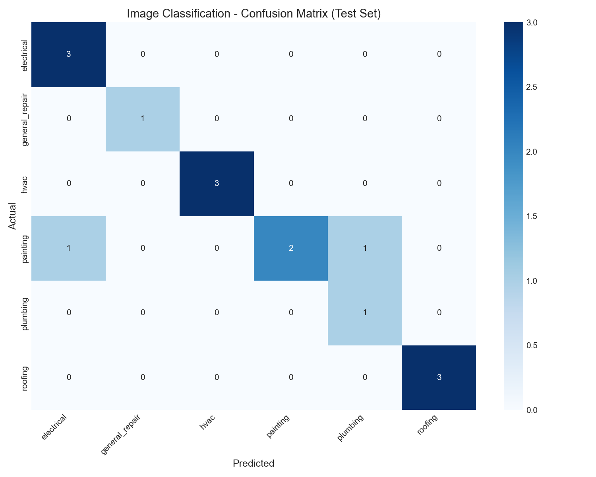


### 8.2 Text Category Classifier

| Metric | Value |
|--------|-------|
| 5-Fold CV F1 (macro) | 0.760 |
| Test Accuracy | 77.8% |
| Test F1 (macro) | 0.780 |

**Per-class test performance**:
- Electrical: F1=0.88, Plumbing: F1=0.76, HVAC: F1=0.73
- Painting: F1=0.83, Roofing: F1=0.86, General Repair: F1=0.62

The category classifier performs well, with general repair being the most challenging class due to its broad scope overlapping with other categories.

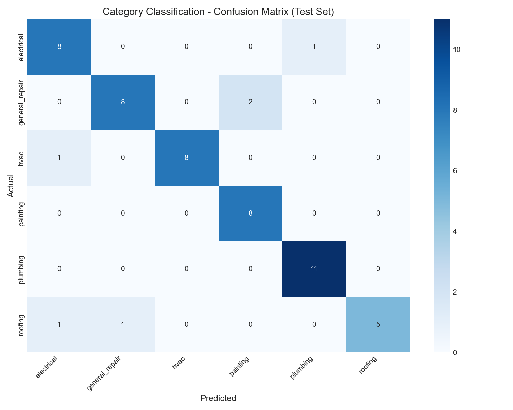

### 8.3 Text Urgency Classifier

| Metric | Value |
|--------|-------|
| 5-Fold CV F1 (macro) | 0.379 |
| Test Accuracy | 60.0% |
| Test F1 (macro) | 0.357 |

The urgency classifier shows weaker performance, particularly for high and emergency classes. This is expected: urgency is a more subjective and nuanced classification task, and the high/emergency classes have fewer training examples. The model reliably distinguishes low from non-low urgency but struggles with fine-grained urgency levels.

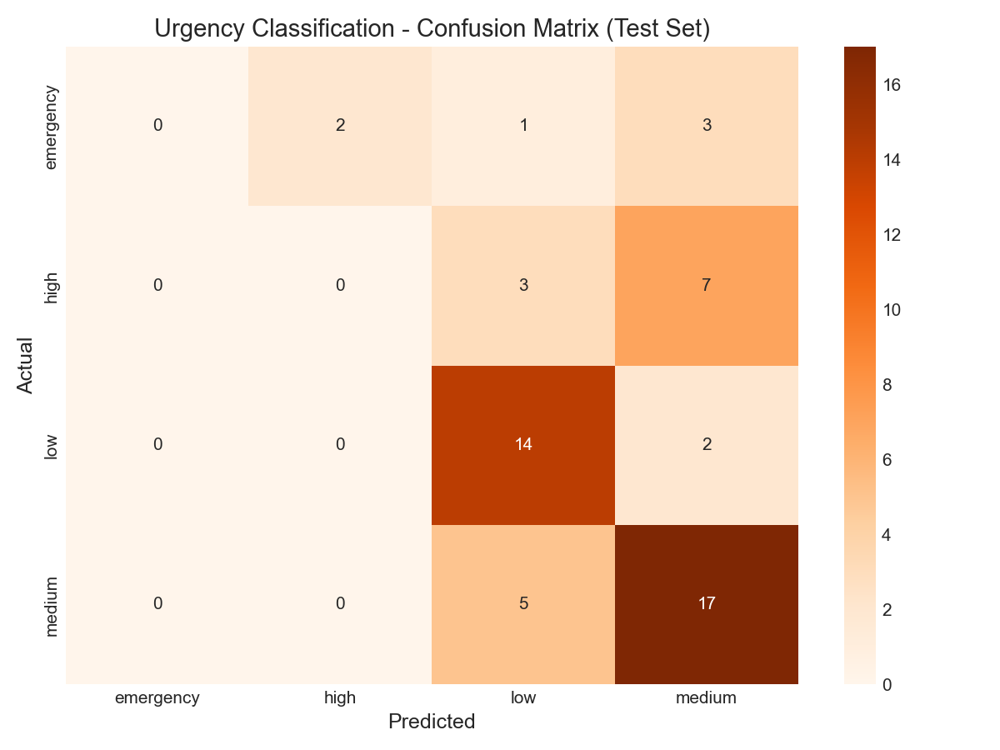

### 8.4 Feature Importance

TF-IDF feature analysis reveals meaningful learned patterns:
- **Plumbing**: "pipe," "water," "leak," "drain," "faucet"
- **Electrical**: "outlet," "breaker," "wiring," "circuit," "electrical"
- **Roofing**: "roof," "shingles," "leak," "storm," "gutter"
- **HVAC**: "ac," "furnace," "heating," "thermostat," "duct"
- **Painting**: "paint," "wall," "ceiling," "exterior," "room"
- **General Repair**: "door," "fence," "deck," "window," "floor"

These features align with domain expertise, confirming the model has learned meaningful category-discriminative vocabulary.

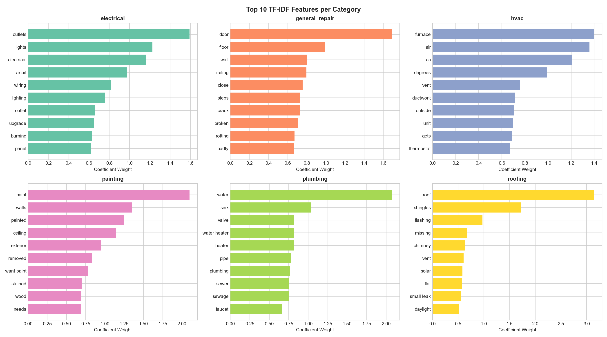

---

## 9. Challenges, Limitations, and Conclusion

### Challenges

1. **Limited Image Data**: With only 15 images per category from web crawling, the image classifier had minimal training data. Transfer learning and aggressive augmentation mitigated this, but the small test set means the 87% accuracy should be interpreted cautiously.

2. **Synthetic Text Data**: The text dataset was synthetically generated rather than collected from real customer requests. While it captures realistic patterns, it may lack the messiness, typos, and ambiguity of authentic customer messages.

3. **Urgency Classification**: Urgency is inherently subjective and context-dependent. The same description ("the faucet is leaking") could be low urgency for a slow drip or high urgency if it's causing flooding. The classifier struggles with this ambiguity.

4. **Category Overlap**: Some categories share visual and textual features. A bathroom renovation might involve plumbing, painting, and general repair simultaneously. The single-label classification approach doesn't capture this multi-label reality.

### Limitations

- **Small dataset size**: Both datasets are small by ML standards. A production system would require thousands of images and texts per category.
- **Domain coverage**: Only 6 categories are covered. Real home services include landscaping, pest control, cleaning, and many other specialties.
- **Pricing accuracy**: Cost estimates are based on national averages and don't account for regional pricing variation, material costs, or contractor availability.
- **No real-time adaptation**: The system doesn't learn from user feedback or update its estimates based on new data.
- **CPU-only training**: Training was limited to CPU, which constrained the choice of models (e.g., could not practically fine-tune a transformer-based image model).

### Future Work

- **Voice input**: Integrate OpenAI Whisper for speech-to-text, allowing voice descriptions
- **Multi-label classification**: Allow images/descriptions to map to multiple categories
- **Regional pricing**: Incorporate ZIP code-based pricing adjustments
- **Feedback loop**: Allow contractors to provide actual costs to improve estimates over time
- **Larger datasets**: Collect real customer request data with consent from partner businesses
- **Transformer models**: With GPU access, fine-tune DistilBERT for text and Vision Transformers for images

### Conclusion

HomeEstimator AI demonstrates that a modular pipeline combining Computer Vision and Natural Language Processing can provide practical value for the home service industry. Despite working with limited data and CPU-only resources, the system achieves reasonable classification accuracy and produces actionable estimates. The project validates the approach of using transfer learning for visual understanding and traditional ML for text classification, combined through a transparent fusion mechanism. The key insight is that in a domain-specific application, simpler models with clear interpretability can be more practical than complex end-to-end systems, especially when data is limited.

---

## 10. References

1. Sandler, M., et al. (2018). MobileNetV2: Inverted Residuals and Linear Bottlenecks. *CVPR 2018*.
2. Pedregosa, F., et al. (2011). Scikit-learn: Machine Learning in Python. *JMLR 12*.
3. Honnibal, M., & Montani, I. (2017). spaCy 2: Natural language understanding with Bloom embeddings, convolutional neural networks and incremental parsing.
4. PyTorch. Paszke, A., et al. (2019). PyTorch: An Imperative Style, High-Performance Deep Learning Library. *NeurIPS 2019*.
5. Streamlit. https://streamlit.io/
6. HomeAdvisor Cost Guides. https://www.homeadvisor.com/cost/
7. Angi (formerly Angie's List). https://www.angi.com/
8. Deng, J., et al. (2009). ImageNet: A Large-Scale Hierarchical Image Database. *CVPR 2009*.
9. Manning, C.D., Raghavan, P., & Schütze, H. (2008). Introduction to Information Retrieval. Cambridge University Press.
10. Bird, S., Klein, E., & Loper, E. (2009). Natural Language Processing with Python. O'Reilly Media.
